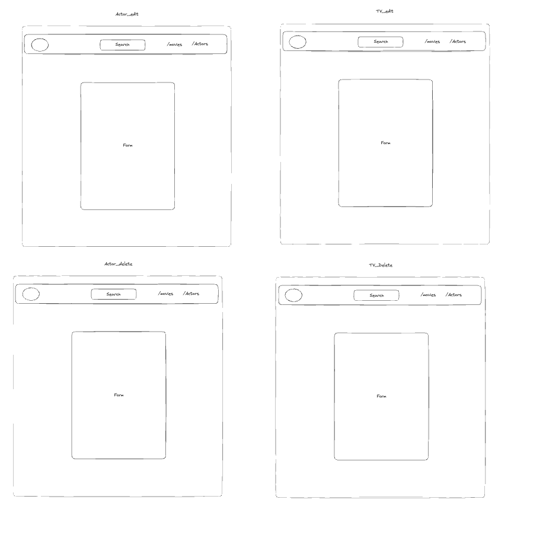
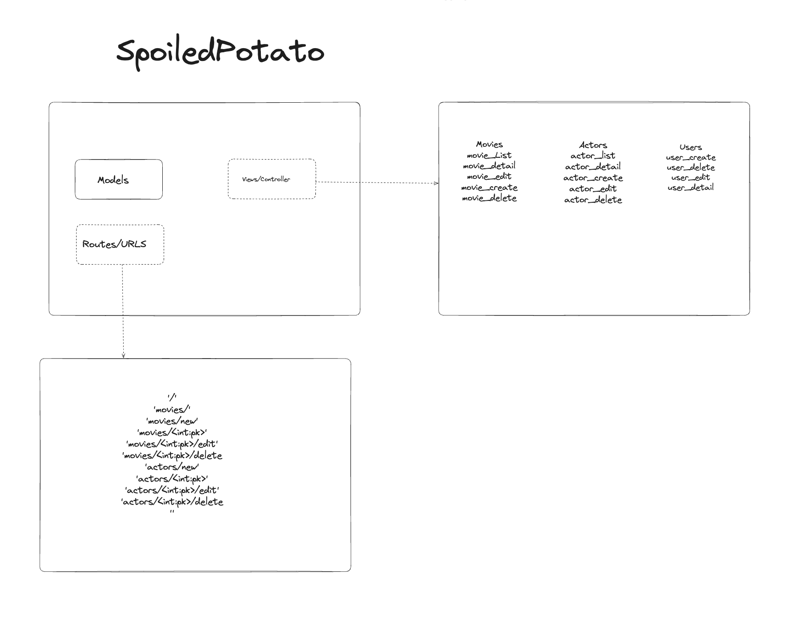
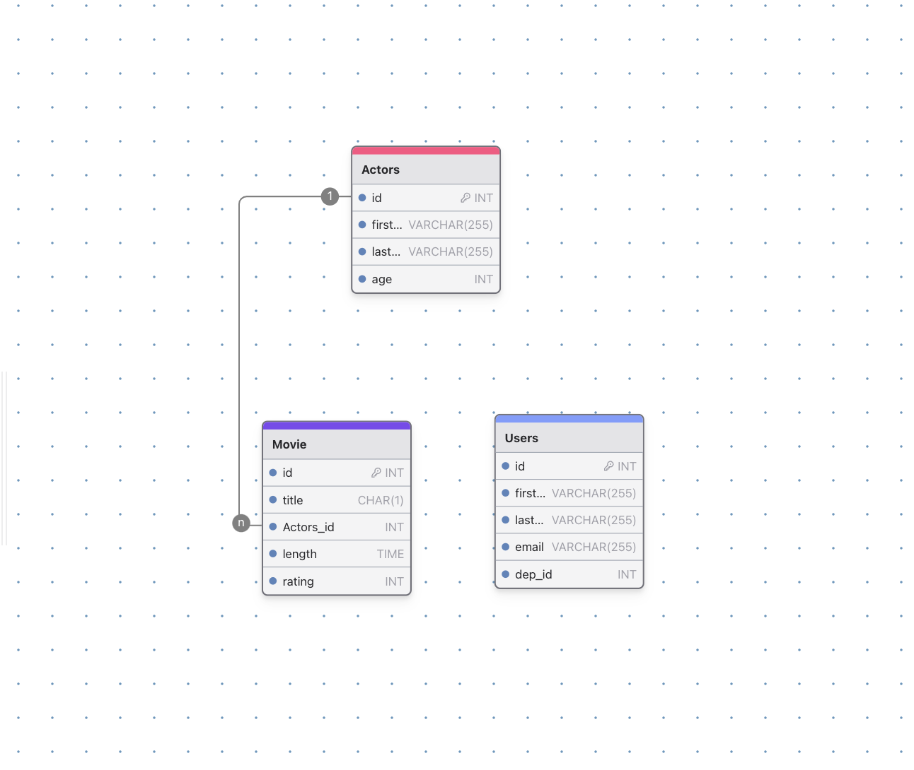

# SEI SEBPT220 Project 3: SpoiledPotato

SpoiledPotato is an Television show reveiwal application enabling user to seamlessly review to All Television shows in their area.

## How It Works


## Features

### TBD

- **TBD:** TBD Description.
- **TBD:** TBD Description.

### TBD

- **TBD:** TBD Description.
- **TBD:** TBD Description.

### TBD

- **TBD:** TBD Description.
- **TBD:** TBD Description.

### TBD

- **TBD:** TBD Descriptiono.

### TBD

- **TBD:** TBD Description

## User Stories

1. **Create an account:**
   - TBD.
2. **TBD:**
   - TBD.
3. **TBD:**
   - TBD.
4. **TBD:**
   - TBD.

## Setup Instructions for Local Deployment

To set up this project locally, follow these steps:

1. **Clone the repository:**

   ```bash
   git clone 
   ```

2. **Navigate to the project directory:**

   ```bash
   cd 
   ```

3. **Install dependencies:**

   ```bash
   npm install
   ```

4. **Set up the environment variables:**

   - Create a `.env` file in the root directory.
   - Add the following environment variables:
     ```
     PORT=3000
     MONGODB_URI=your_mongodb_connection_string
     SECRET_KEY=your_secret_key
     ```

5. **Run the application:**

   ```bash
   npm start
   ```

6. **Open your browser and visit:**
   ```
   http://localhost:8000
   ```

## Live Demo

[Live Demo Site]()

## Models

### User

- **TBD:** TBD
- **TBD:** TBD

## Code Snippets

### TBD


## Inspiration

- [RottenTomatoes](https://www.rottentomatoes.com/)

## Mockups






